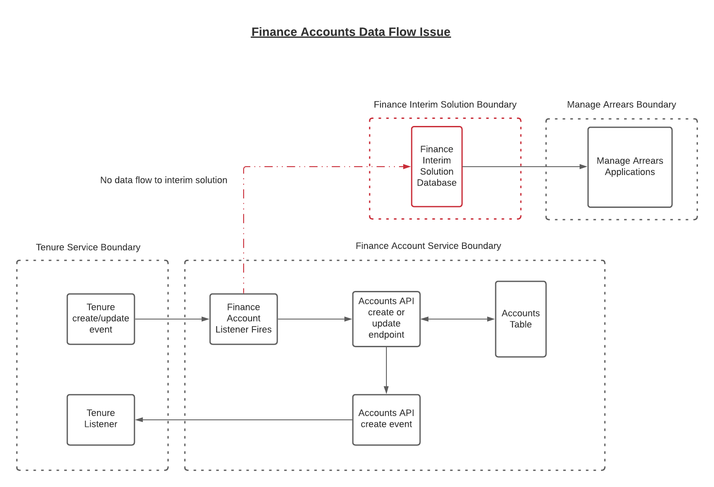

# Finance Data Sync To Interim Finance Solution

### **Date:** 13th January, 2022

### **Status:**  PROPOSED

## **Context**

There is currently a gap in the flow of data in finance systems of Modern Tools for housing with regards to created and/or updated accounts.  The current workflow is as follows:
- Tenure records are created or updated in the Manage My Home (MMH) work stream.
- Events are triggered from the Tenure API when these records are created or updated.
- A listener in the Finance service is used to check for these events and update the accounts entity with matching records.

## **The Problem**
New tenure records are created via MMH. For each new tenure, an account record with a payment reference gets created. The 'Accounts API' and listener are used to achieve this - both of those components are part of the Final Finance System.

Currently this process does not factor in the Interim Finance solution so this service does not automatically receive new or updated records.  At the moment a spreadsheet is being used to store this information and manually get it into the interim solution.  It means that these records may not be available on the interim solution on a timely basis.  The diagram below illustrates the current flow of data as it is and how the interim solution does not fit within the overall process.

## **Decision**

**Pushing data to spreadsheet on MMH Create or Update events**

As there is already a solution in place that listens for updates to tenure records coming from MMH, this can be extended to also populate the specified spreadsheet.  The data in the spreadsheet can subsequently be used to update the Interim Finance solution.  The spreadsheet will be a temporary measure to allow relevant users the opportunity to validate the data going into the finance solution.  The spreadsheet should also be read only to maintain the integrity of the data.  Any changes needed would be done at the source (eg tenure information in MMH and PRNs in Finance) so there will be a unidirectional flow of data.

**Phasing out the spreadsheet**

Once users are confident that the data flowing to the interim solution is correct.  Steps would be taken to push data directly to the interim solution and remove the intermediate step of saving to the spreadsheet.

## **Consequences**
Having this in place will eliminate the manual data input to spreadsheet and have a consistent and real time process for updating/synchronising all areas where this data is required and eliminate the need for human intervention.